# Databank Research Database — Handbook

## 1. Welcome

Databank has tracked every apartment community, office, shopping center, industrial building,
land parcel and franchise site in metro Atlanta for 50 years. The Research Database puts that
history at your fingertips: search it, ask it questions in plain English, and download reports.

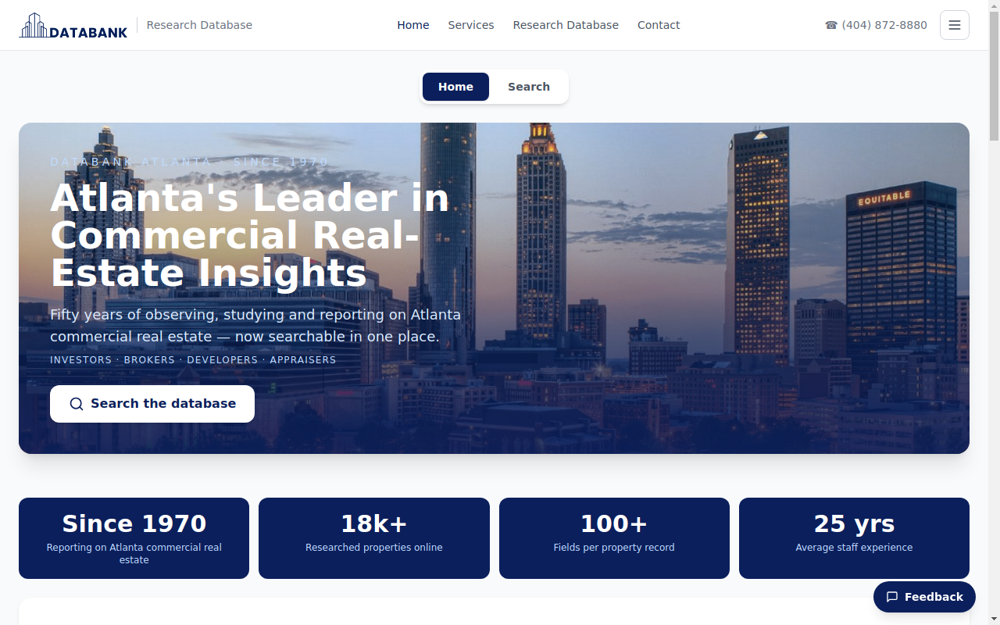

- **Home** — the front page, with this week's market pulse.
- **Search** — the database itself. Click **Research Database** in the top bar, then
  **Continue as guest**.
- **☰ menu** (top right) — this Handbook and the Home / Search switch.

Six databases, one tab each: **Apartments · Franchise · Industrial · Land · Offices · Retail**.
Everything on the Search screen — the table, Ask AI, Dashboard, History — follows the tab you
pick. *Offices and Retail draw from the same Databank file, so they show the same properties.*

## 2. The Search screen

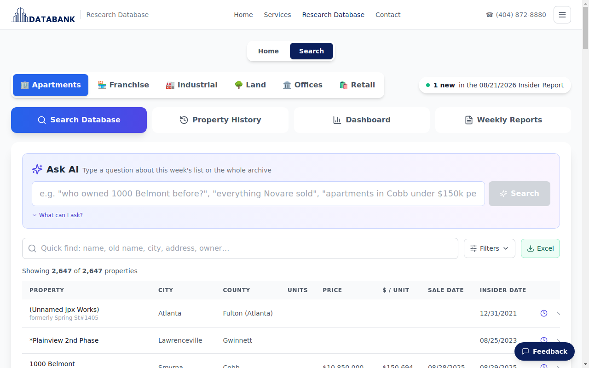

Top to bottom:

1. **Database tabs** — pick Apartments, Industrial, Land…
2. **"1 new in this week's Insider Report"** — how many properties were added this week.
3. **View buttons** — Search Database · Property History · Dashboard · Weekly Reports.
4. **Ask AI** box — type a question (§3).
5. **Quick find**, **Filters** and **Export to Excel** (§4, §7).
6. **Results table** — this week's list. Click any column header to sort. Each row has a
   **clock** icon (the property's full history, §6) and a **⌄** arrow (expands the row).

## 3. Ask AI — questions in plain English

Type a question the way you would ask a colleague. You get a **one-sentence answer** first,
then the records behind it.

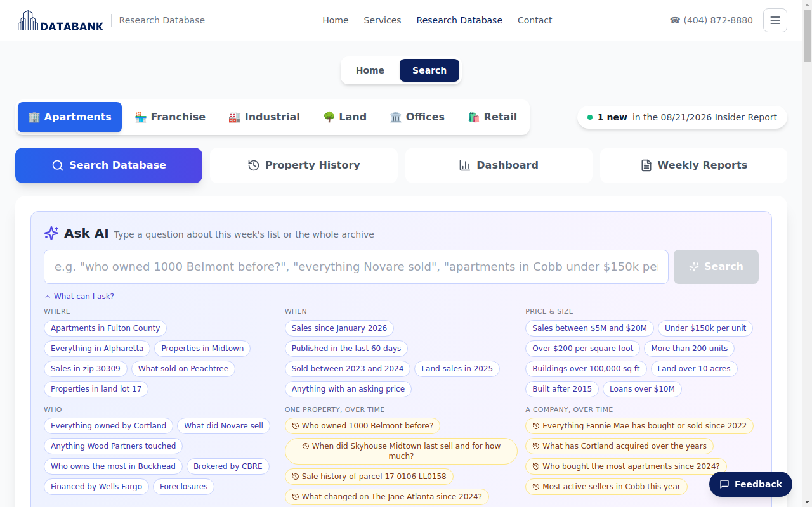

Things you can ask:

- **One property** — *Who owned 1000 Belmont before?* · *History of Skyhouse Midtown*
- **A company** — *What has Cortland bought since 2023?* · *Who did Wexford sell to?*
- **A pattern** — *Which apartment communities sold more than once since 2022 in Cobb?* ·
  *Largest sales in Fulton this year* · *Most active buyers in 2025*
- **An area** — *Apartments sold in 30305 or 30309 since 2024*
- **The data itself** — *How far back does the sales data go?*

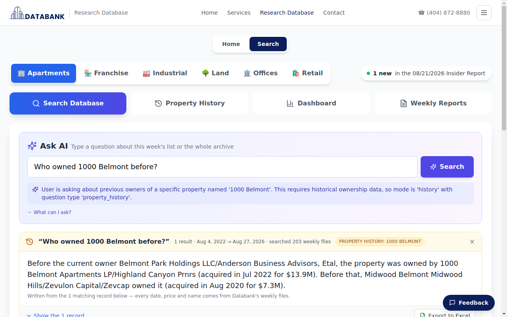

Under the answer: **Show the records** lists every matching property, each with a
**Report / PDF** link (§7); **Export to Excel** downloads them all. Click **×** on the answer to
return to this week's list.

> Tip: if a question about *who bought X* comes back empty, phrase it as *history of X* or
> *who owned X before* — it will search the whole archive rather than this week's list.

## 4. Quick find and Filters

### Quick find

Type any part of a name, former name, city, address or owner. Spelling doesn't have to be
exact — *Austel* finds *Austell*. Street types can be spelled out or abbreviated (*1898 spring
road smyrna* finds *1898 SPRING RD.*), and words like *the* are ignored, so *the mason augusta*
finds *Mason Augusta*. If no property matches every word you typed, Quick find shows the
closest matches instead and says so above the table.

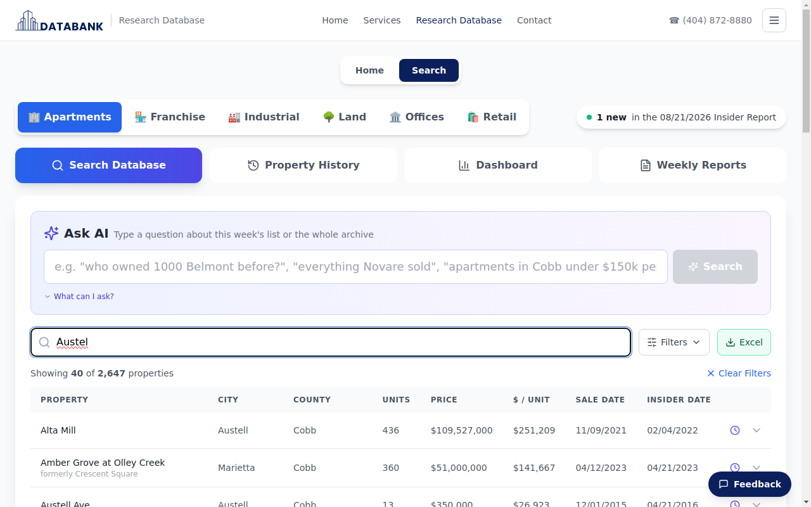

### Filters

Click **Filters** to narrow the list: county, city, several **zip codes at once**
(`30305, 30309`), units, year built, price, sale date, owner, seller, buyer, street.
The count at the top of the table updates as you go; **Clear** resets everything.

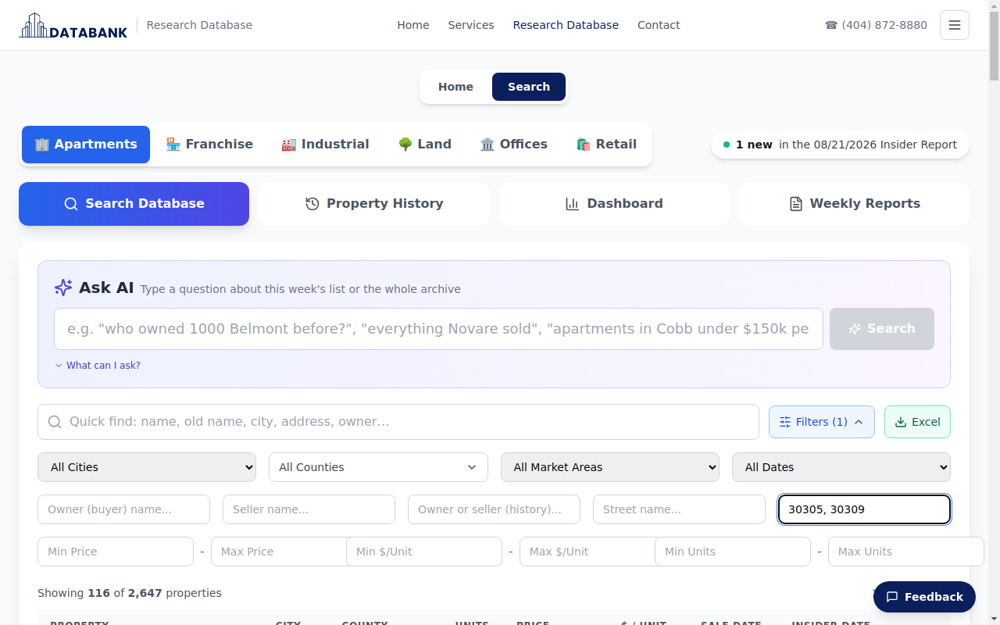

## 5. Reading a property

Click any row to open its card: what the property is, who owns it, the last sale, the
lender, and Databank's notes.

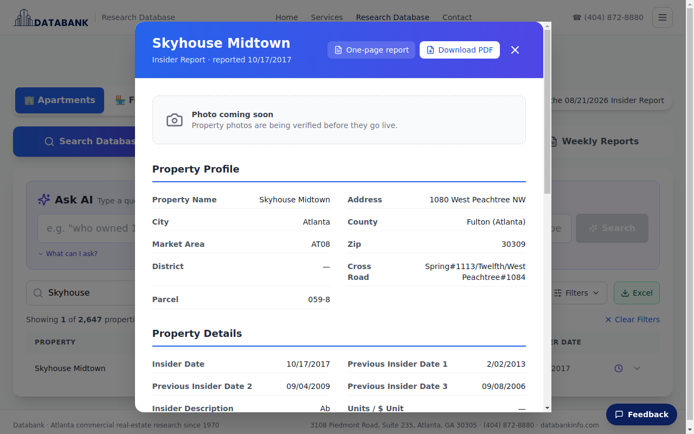

Top right of the card: **One-page report** and **Download PDF** (§7), and **×** to close.

### Photo and map

Under the title you'll see the property's Street View photo. Where Google has no street-level
photo for the address (common for land parcels), a map pinned on the address takes its place,
with a note saying so. Below that is a **View on map** bar. Click **View on map** to open a Google map pinned on the address right
inside the card, or **Open in Google Maps** to jump to Google Maps in a new tab for directions
and Street View.

Both come from Google Maps and are matched by address, so the photo or pin may be a short
distance from the property itself — treat them as a guide, not a survey.

## 6. Property History — the clock icon

The row card is *this week's* record. The **clock** shows the property's **whole life** in
Databank's files: every owner, every sale, every name change.

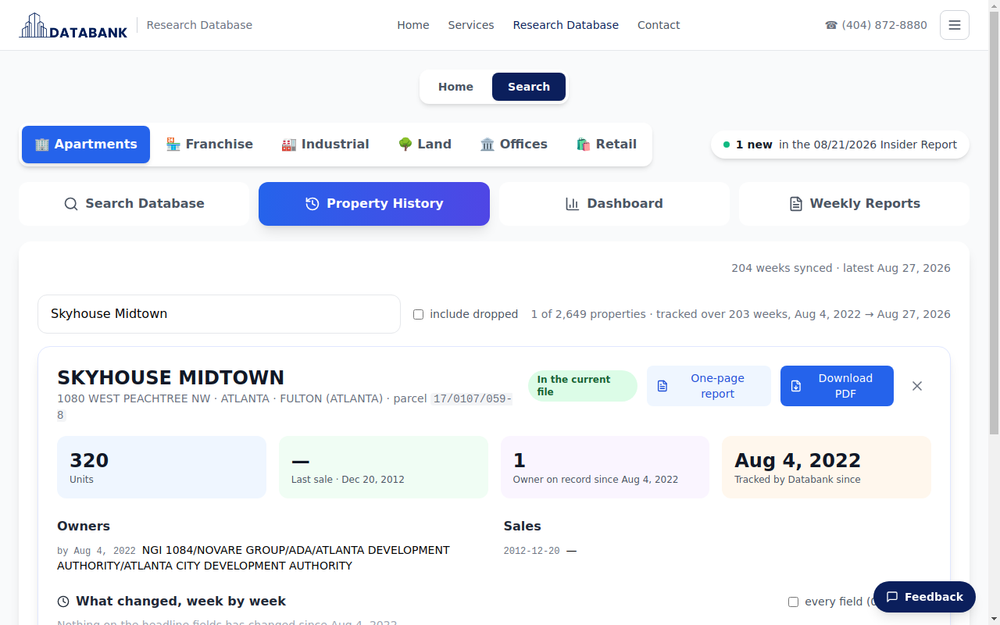

- **Owners** — every owner on record, in order, with dates.
- **Sales** — each sale with price and buyer.
- **What changed, week by week** — a timeline of every change Databank recorded.
- **One-page report** and **Download PDF** buttons at the top right.
- **View on map** / **Open in Google Maps** — the same map bar as on the row card.

You can also open **Property History** from the view buttons and search for a property by
name, address, parcel or owner.

## 7. Reports and Excel

### One-page report

Every property has a clean one-page report: summary, owners, sales and key facts — no
hundred-field printout.

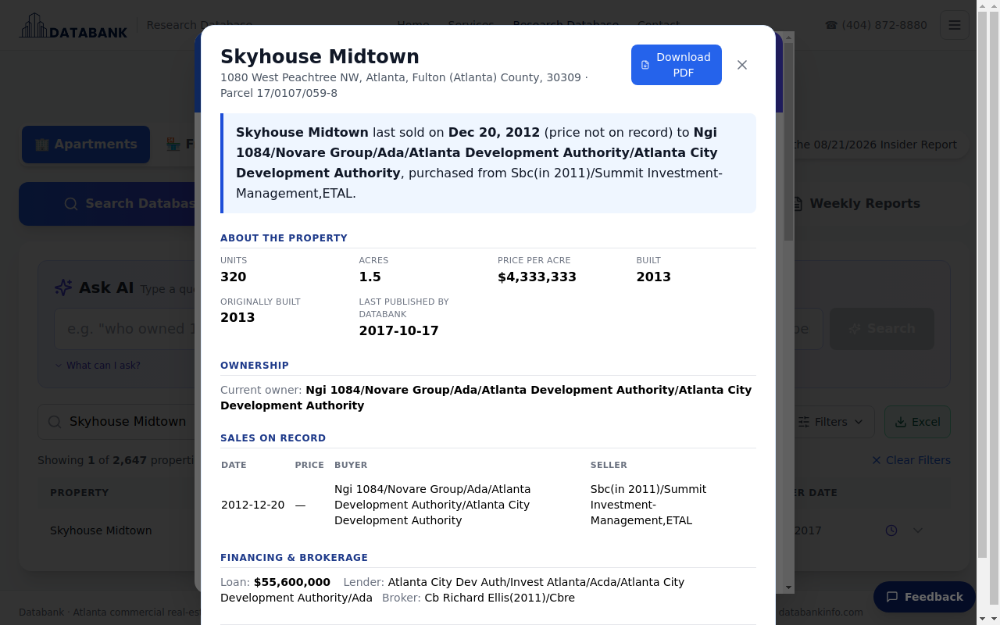

### Download PDF

The same report as a PDF with the Databank letterhead, ready to forward to a client.

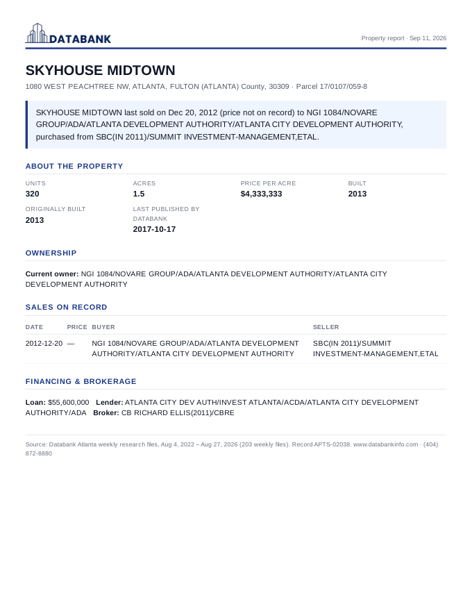

### Export to Excel

Whatever is in the table — a filtered list or an Ask AI result — downloads as a spreadsheet
with the **Export to Excel** button.

## 8. Dashboard and Weekly Reports

### Dashboard

Market numbers for the selected database: recent sales activity, top counties, cities, zip
codes and owners. **Click any row** — a county, a city, a zip, an owner — to see exactly those
properties in the table. **Download PDF** gives a one-page Market Snapshot.

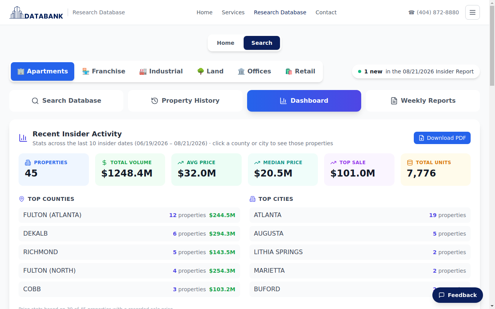

### Weekly Reports

Databank's weekly Insider Reports, newest first — open any week to see what was new.

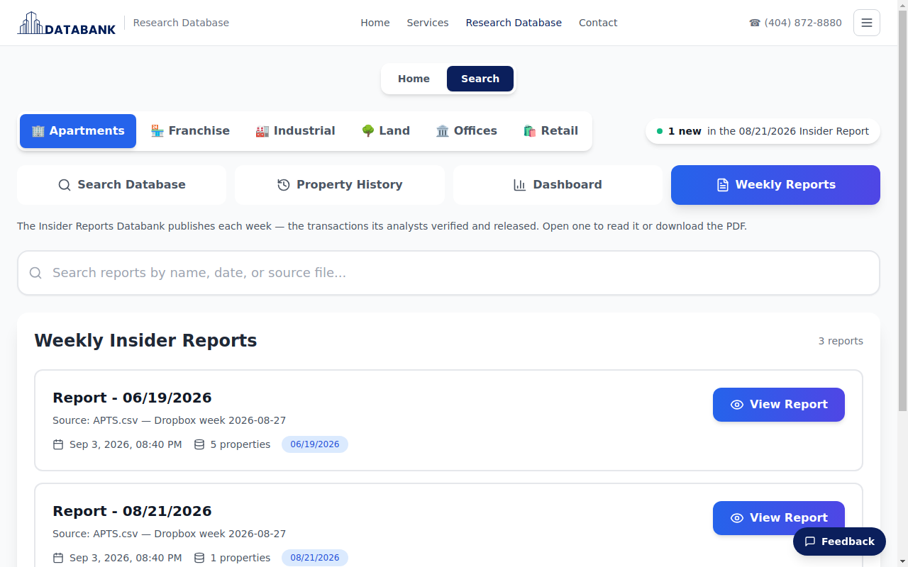

## 9. Feedback

Spotted something wrong, or want a feature? Click **Feedback** (bottom right of every
screen), type your note and send — it goes straight to the Databank team.

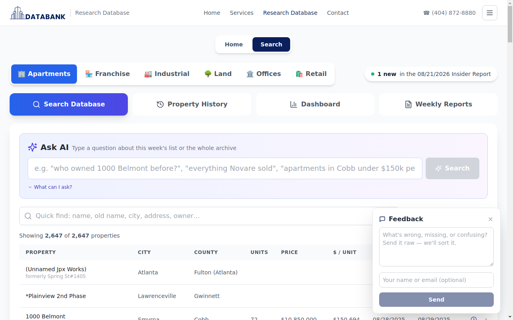

## 10. FAQ

**How far back does the data go?** Sale dates go back to September 1982. Week-by-week
ownership history is available from August 2022 onward.

**Why does the table say 2,647 properties but Ask AI says 1 result?** The table is this
week's full list; an Ask AI answer shows only the properties that match your question.

**Can I search more than one zip code?** Yes — in Filters type `30305, 30309`, or ask
*sold in 30305 or 30309 since 2024*.

**Where do the property photos come from?** Google Maps Street View, matched by address. Each
photo shows the nearest available street-level view, so it may not reflect the property exactly
or its current condition — accuracy is not guaranteed. Where Google has no street-level photo
for an address, the card shows a map of the location instead.

**Can I see the property on a map?** Yes — click **View on map** on the property card or in
Property History, or **Open in Google Maps** for directions.

**Can I save a search?** Not yet — export it to Excel, or simply ask Ask AI the same question
again.

**Offices and Retail show the same properties — is that right?** Yes; Databank publishes
them as one file.

**Who do I contact?** Databank Atlanta · (404) 872-8880 · or use the **Feedback** button.
