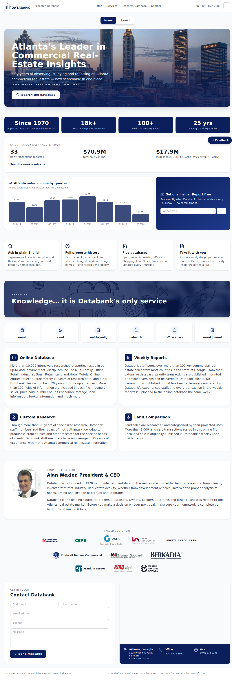
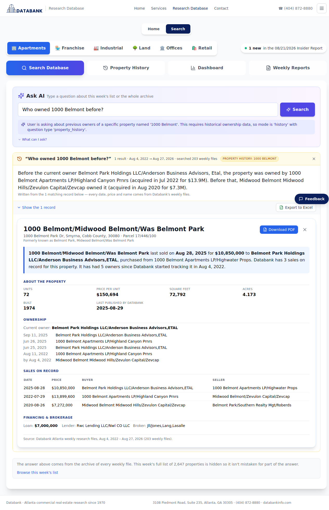
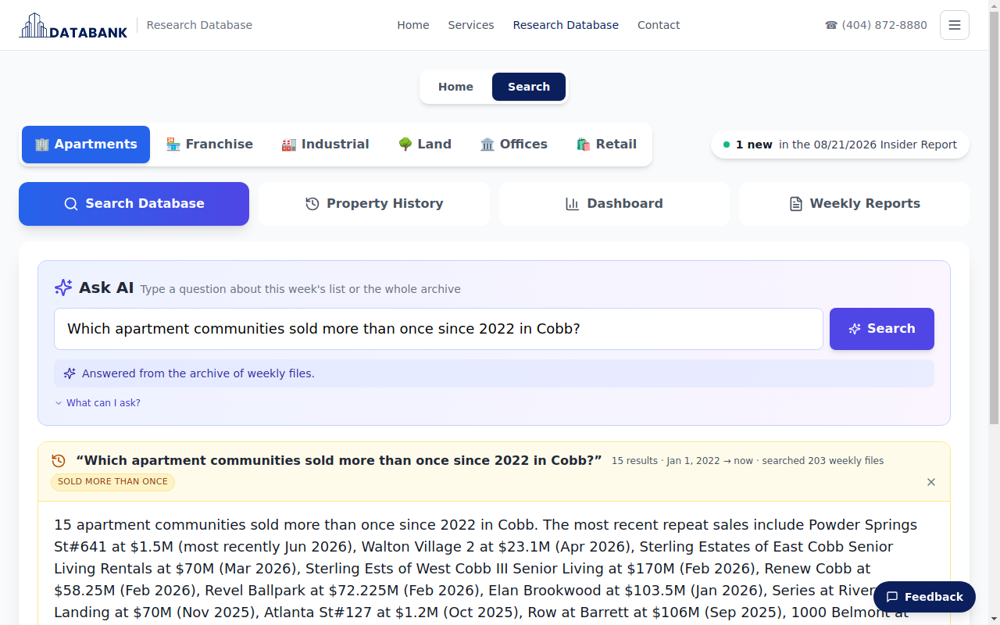
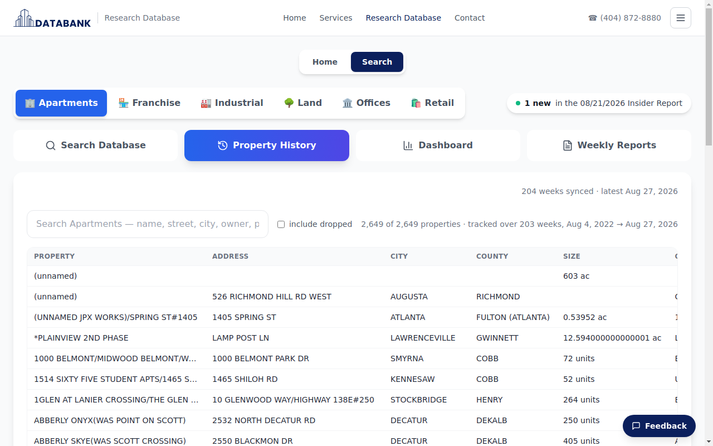
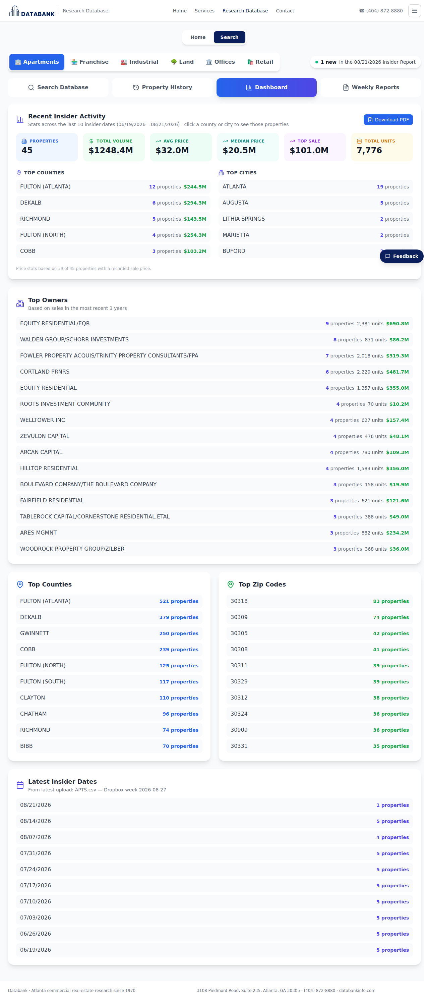
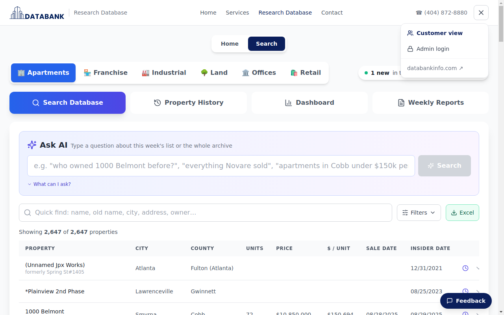
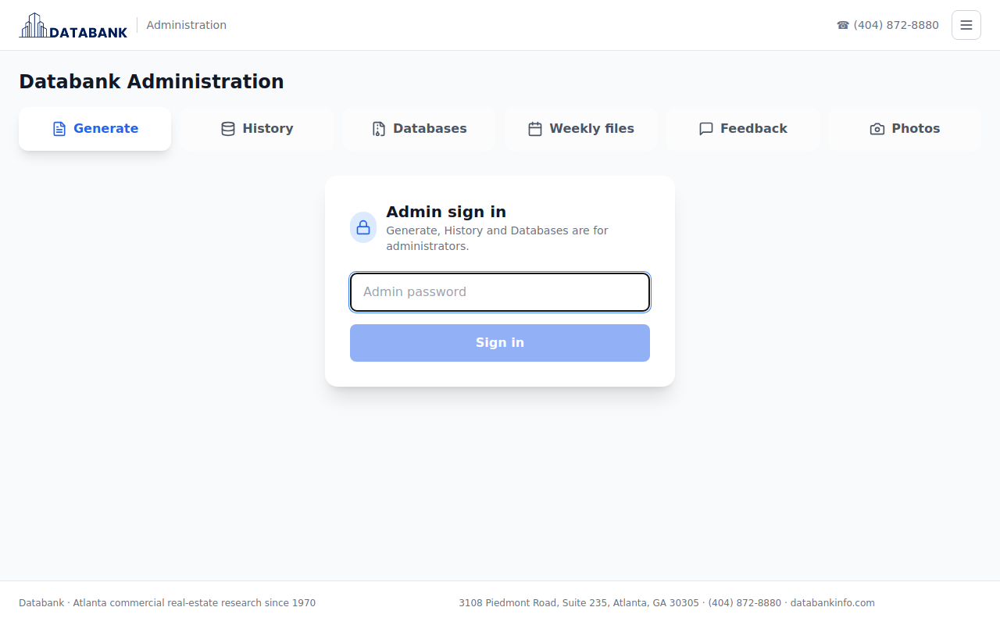
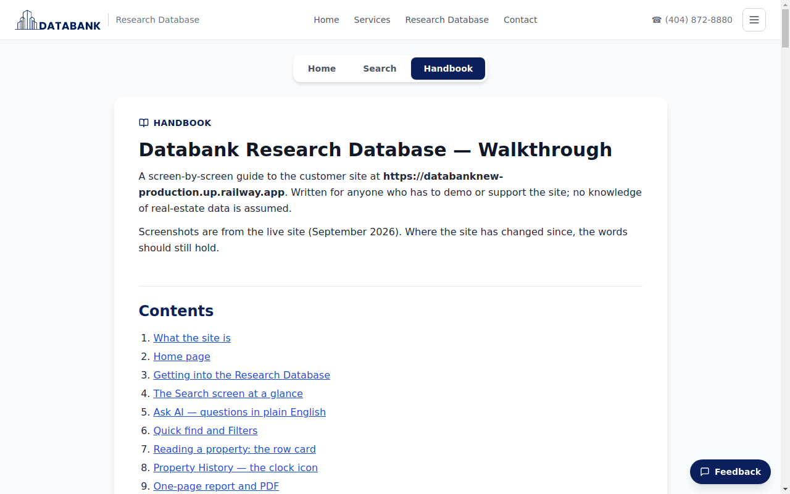

# Databank Research Database — Walkthrough

A screen-by-screen guide to the customer site at
**https://databanknew-production.up.railway.app**. Written for anyone who has to demo
or support the site; no knowledge of real-estate data is assumed.

Screenshots are from the live site (September 2026). Where the site has changed since,
the words should still hold.

---

## Contents

1. [What the site is](#1-what-the-site-is)
2. [Home page](#2-home-page)
3. [Getting into the Research Database](#3-getting-into-the-research-database)
4. [The Search screen at a glance](#4-the-search-screen-at-a-glance)
5. [Ask AI — questions in plain English](#5-ask-ai--questions-in-plain-english)
6. [Quick find and Filters](#6-quick-find-and-filters)
7. [Reading a property: the row card](#7-reading-a-property-the-row-card)
8. [Property History — the clock icon](#8-property-history--the-clock-icon)
9. [One-page report and PDF](#9-one-page-report-and-pdf)
10. [Export to Excel](#10-export-to-excel)
11. [Dashboard and the Market Snapshot PDF](#11-dashboard-and-the-market-snapshot-pdf)
12. [Weekly Reports](#12-weekly-reports)
13. [Feedback button](#13-feedback-button)
14. [Menu, Admin login and admin tools](#14-menu-admin-login-and-admin-tools)
15. [Demo script (10 minutes)](#15-demo-script-10-minutes)
16. [What to avoid in a demo / known limits](#16-what-to-avoid-in-a-demo--known-limits)
17. [FAQ](#17-faq)
18. [Handbook on the site](#18-handbook-on-the-site)

---

## 1. What the site is

Databank Atlanta has published a weekly **Insider Report** on Atlanta commercial real-estate
sales since 1970. Each week's report is a list of properties (apartments, franchise, industrial,
land, offices, retail) with the owner, seller, sale price, loan, broker and ~100 other fields.

This site takes every weekly file Databank has put in Dropbox since **August 2022** (about
200 weeks) and does three things with them:

| | |
|---|---|
| **This week's list** | The latest Insider Report, searchable and filterable. This is what the table on the Search screen shows. |
| **Property history** | Every weekly record for the *same* property is merged into one timeline: who owned it, who sold it, each sale and price, name changes. The site tracks ~2,650 apartment communities this way (and the other five databases likewise). |
| **Ask AI** | Type a question in plain English and get a written answer from those records, with the matching rows underneath. |

Sale dates inside the records go back to **September 1982** — the files start in 2022, but each
record carries its own "last sale" date. There are no pre-1982 sales anywhere in the data.

---

## 2. Home page

`https://databanknew-production.up.railway.app/`

The public front page, aligned with databankinfo.com: hero, headline numbers, the
**Latest Insider Week** market pulse (live from the data), Services, Valued Customers,
About (Alan Wexler), and a Contact form that emails the team.

- The **Home / Search / Handbook** toggle under the header switches between the public page,
  the Research Database and this guide.
- **Search the database** (white button in the hero) and **Research Database** in the top nav
  do the same thing.
- The ☰ button at top right opens the menu (see §14).

Full Home page

---

## 3. Getting into the Research Database

Click **Research Database** or **Search**. Customer logins are **not built yet** — if a login
pop-up appears, choose **Continue as guest — public preview**. Everything in this guide works
as a guest.

Direct link to the search screen: `https://databanknew-production.up.railway.app/#search`

---

## 4. The Search screen at a glance

Top to bottom:

1. **Database tabs** — Apartments · Franchise · Industrial · Land · Offices · Retail.
   Everything below (Ask AI, table, Dashboard, History) is scoped to the selected tab.
   *Offices and Retail share one Databank file (OFFSHOP), so they show the same records.*
2. **"1 new in the 08/21/2026 Insider Report"** — how many properties were added in the
   latest weekly file.
3. **View buttons** — Search Database · Property History · Dashboard · Weekly Reports.
4. **Ask AI** box (§5).
5. **Quick find**, **Filters**, **Excel** (§6, §10).
6. **Results table** — "Showing 2,647 of 2,647 properties". Click any column header to
   sort. Each row has a **clock** (Property History, §8) and a **⌄** arrow (expands the row
   in place).

---

## 5. Ask AI — questions in plain English

Type a question and press Enter (or **Search**). Ask AI decides whether the question is
about **this week's list** (it then fills in the filters for you) or about the **whole
archive** (it then searches the history and writes an answer).

### "What can I ask?"

Click the small **What can I ask?** link under the box to see the catalogue of question
types with examples. Clicking an example runs it.

### A property question

> Who owned 1000 Belmont before?

What you get:

- A one-line note on how the question was understood (blue strip).
- An **answer card** titled with your question, with the scope ("1 result · Aug 4, 2022 →
  Aug 27, 2026 · searched 203 weekly files") and a small tag showing the question type.
- **The answer in sentences**, written only from the matched records — every date, price and
  name comes from Databank's files; the AI does not invent numbers.
- Below it: **Show the N records** (the backing rows) and **Export to Excel**. Each record
  in that list has a **Report / PDF** link that opens the one-page report (§9).

While an archive answer is showing, this week's full table is hidden so it is not mistaken
for results; **Browse this week's list** brings it back. Asking a new question replaces the
previous answer and clears its filters.

Answer with the records expanded

### A list question

> Which apartment communities sold more than once since 2022 in Cobb?

The answer summarises the set (counts, biggest sales, most active buyers) and the full list
of matching records is underneath — all of them, not a sample — with Export to Excel.

### Questions that work well

| Type | Examples |
|---|---|
| One property | "Who owns Skyhouse Midtown?" · "History of 1000 Belmont" · "When did Lodge at Saint Moritz last sell and for how much?" |
| A company | "Everything Novare sold" · "What has Cortland bought since 2024?" |
| A period / area | "Apartment sales in Cobb over $50M since 2024" · "Sales in 30305 or 30309 since 2023" · "Sold in Savannah, 200+ units, Sep 2024 – Sep 2026" |
| Patterns | "Which properties sold more than once since 2022?" · "Most active buyers in 2025" · "Apartments sold before 1990 and never resold" |
| The data itself | "How far back does the sales data go?" |
| This week's list | "Apartments in Gwinnett under $150k per unit" · "New this week in Fulton" |

Tips: use the property name as Databank prints it (Quick find will show it); typos are
tolerated ("Austel" finds Austell); "who bought X" and "who owns X" mean the same thing.

---

## 6. Quick find and Filters

### Quick find

Type any part of a name, **former name**, city, address or owner. Matching is
typo-tolerant.

### Filters

Click **Filters** to open the filter row (collapsed by default). Filters stack with Quick
find and with each other; **Clear Filters** resets.

- **City · County · Market Area · Dates** dropdowns (alphabetical).
- **Owner (buyer)**, **Seller**, **Owner or seller (history)** — the last one searches past
  owners too.
- **Street name**.
- **Zip codes** — several at once, separated by commas or spaces: `30305, 30309`.
- **Price**, **$ / Unit** ($ / SF for Industrial), **Units** ranges.

The count line ("Showing 116 of 2,647 properties") updates as you type.

---

## 7. Reading a property: the row card

Click anywhere on a row to open the **row card** — that property's record from this week's
file, laid out in sections (Property Profile, Property Details, Financial, Comments), with
the photo if approved.

Top right: **One-page report** and **Download PDF** (§9), and × to close.

The **⌄** arrow at the end of a row expands the same details in place, without a pop-up.

---

## 8. Property History — the clock icon

The **clock** at the end of a row opens the property in the **Property History** view:
the same property across *all* weekly files, not just this week.

- Header: name, address, county, parcel; **In the current file** badge if it is in this
  week's list.
- Tiles: **Units**, **Last sale**, **Owner on record since**, **Tracked by Databank since**.
- **Owners** and **Sales** lists (one line per real change; one-week typos are ignored).
- **What changed, week by week** — a change log of the headline fields; tick
  **every field** to see all ~100.
- **One-page report** and **Download PDF** buttons (§9).

You can also open the **Property History** view button directly and search there — it
searches names, former names, streets, cities, owners, past owners and parcels across the
whole archive, and can **include dropped** properties (ones no longer in the current file).

Row card vs. clock, in one line: **the row card is this week's record; the clock is the
property's whole life in Databank's files.**

---

## 9. One-page report and PDF

Available from three places — the Ask AI answer for a single property, the Property
History card, and the row card. All three produce the same report.

**One-page report** opens it on screen:

**Download PDF** saves it as a branded one-page PDF (Letter size):

Sections: headline sentence (last sale, price, buyer, seller) · About the property ·
Ownership · Sales on record · Financing & brokerage · Source line with the weeks searched
and the record ID. Prices that Databank did not record show as "—" rather than a guess.

---

## 10. Export to Excel

- **Excel** button next to Filters exports whatever the table currently shows (all rows,
  after Quick find and Filters), as `.xlsx`.
- **Export to Excel** under an Ask AI answer exports that answer's matching records.

Open decision (from Blake): whether to cap rows per export or meter/bill per downloaded
record. Nothing is limited today; per-company counting needs customer logins first.

---

## 11. Dashboard and the Market Snapshot PDF

The **Dashboard** view shows **Recent Insider Activity** for the selected database over the
last ten Insider dates: properties, total volume, average / median / top sale, total units,
then Top Counties, Top Cities, Top Zip Codes, Top Owners.

- **Click any row** (a county, city, zip or owner) to jump to Search Database filtered to
  exactly those properties.
- **Download PDF** (top right) produces a one-page **Market Snapshot** PDF of what is on
  screen, with the Databank logo.

Full Dashboard

---

## 12. Weekly Reports

The Insider Reports Databank has published, as documents: search by name, date or source
file; **View Report** opens it, with a PDF download. These are published by the admin — 
customers cannot save anything here (the tab used to be called "Saved Reports", which is why
people looked for a save button).

---

## 13. Feedback button

Bottom-right on every screen. Anything typed here is stored and **emailed to the team**,
with the page it was sent from. This is the preferred channel for Blake and customers.

---

## 14. Menu, Admin login and admin tools

The ☰ button at top right:

- **Customer view** — the public site (what this guide covers).
- **Handbook** — this guide, on the site itself (see §18).
- **Admin login** — `https://databanknew-production.up.railway.app/admin`, password
  protected.
- **databankinfo.com** — the existing Databank website.

Admin tools (not visible to customers): **Photos** (approve / reject the Google Street View
photo pulled for each property — customers see "Photo coming soon" until approved),
**Feedback** list, **Generate** weekly report documents, **Weekly files** (each raw Dropbox
week, every file in the zip), **Databases** status and Dropbox sync.

---

## 15. Demo script (10 minutes)

1. **Home** — "This is Databank, 50 years of Atlanta research, now searchable." Point at the
   Latest Insider Week pulse. Click **Search the database** → Continue as guest.
2. **Ask AI, one property** — type *Who owned 1000 Belmont before?* Read the sentence out
   loud. Click **Show the 1 record**, then the row's **Report / PDF** → Download PDF. Open the PDF.
3. **Ask AI, a pattern** — *Which apartment communities sold more than once since 2022 in
   Cobb?* Scroll the list. Click **Export to Excel**.
4. **Filters** — clear the answer (×), open **Filters**, type `30305, 30309` in Zip codes.
   "116 properties in two zips."
5. **Row card vs. history** — click a row (this week's record), close, click its **clock**
   (whole life). Point out Owners, Sales, and *What changed week by week*.
6. **Dashboard** — click **Dashboard**, click **Fulton (Atlanta)** to show the drill-down,
   go back, **Download PDF** for the Market Snapshot.
7. **Feedback** — "Anything you want changed, type it here; it goes straight to us."

---

## 16. What to avoid in a demo / known limits

- **Customer logins** are not built — always use *Continue as guest*.
- **Photos**: only admin-approved ones show; most are still pending ("Photo coming soon").
- **No sales before Sep 1982** in the data; the weekly files themselves start Aug 2022.
- **Offices and Retail** tabs show the same records (one Databank file covers both).
- **"Who bought X?"** for a property that is *not* in this week's list may answer from the
  weekly list (0 results) — phrase it as *"history of X"* or *"who owned X before"* if that
  happens.
- Ask AI is rate-limited per visitor (a few dozen questions an hour) — fine for demos.
- Excel export is unlimited today; see §10 for the open decision.

---

## 17. FAQ

**Where do the photos come from?** Google Street View, by address, through Google's API
(within the free tier today). They are pulled automatically and held for admin approval.

**Are all six databases live?** Yes; each tab reads Databank's latest weekly file for that
type, and the history for each is built from every week since Aug 2022. New weeks appear
automatically when Databank drops the zip in Dropbox.

**Why does the table say 2,647 but the Ask AI answer says 1 result?** The table is this
week's list (all properties currently tracked); an Ask AI archive answer shows only the
records that match the question.

**What is "Tracked by Databank since Aug 4, 2022"?** The first weekly file the property
appears in — it is the start of the archive, not the date the property was built or
bought.

**How do I ask about several zip codes?** In the Zip filter: `30305, 30309`. In Ask AI:
"sold in 30305 or 30309 since 2024".

**Can I save a search?** Not yet. Export it to Excel, or bookmark the question for Ask AI.

---

## 18. Handbook on the site

This guide is also published on the site itself, so Blake, customers and anyone demoing can
read it without leaving the browser:

`https://databanknew-production.up.railway.app/#help`

- Open it from the **Handbook** button in the Home / Search / Handbook toggle, or from the
  ☰ menu → **Handbook**.
- It is the same document as `docs/walkthrough.md` in the repository, rendered live — any
  edit to the Markdown file shows up on the site at the next deploy, no separate copy to
  maintain.
- The **Contents** links jump within the page; a section can be linked directly, e.g.
  `/#help/5-ask-ai--questions-in-plain-english`.
